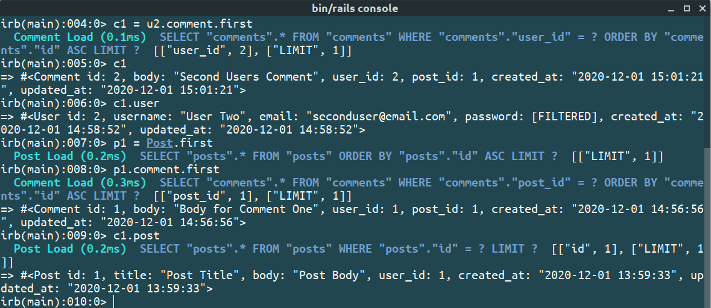

# Micro-Reddit

> This is a mini-project that builds the data model required to create a basic version of Reddit. It includes the functionality for creating/storing/retrieving users, posts and comments.

> It is built using the 'Active Record' feature in Ruby on Rails



## Built With

- Ruby
- Ruby on Rails
- SQLite
- Atom
- VS Code

### Getting Started

### Prerequisites

To get this project up and running locally, you must have installed, ruby, rails and the necessary gems.

**To get this project set up on your local machine, follow these simple steps:**

1. Open Terminal.
2. Navigate to your desired location to download the contents of this repository.
3. Copy and paste the following code into the Terminal: git clone https://github.com/enkog/Micro-Reddit
4. Run ```cd Micro-Reddit```.
5. Run ```bundle install``` to get the necesary gems.
6. Run `rails db:migrate`.

## Usage

- To start using the commands, you have to run ```rails console``` in te the root directory of the project.

- Creating Users
> ```user1 = User.create(username: 'User One', password: 'password', email: 'userone@email.com') ```
 >```user2 = User.create(username: 'User Two', password: 'password', email: 'usertwo@email.com') ```

- Creating Posts
> `post1 = user1.posts.create(title: 'Post One Title', body: 'Post One Body')`
> `post2 = user2.posts.create(title: 'Post Two Title', body: 'Post Two Body')`

- Creating Comments
> `comment1 = post1.comments.create(body: 'Comment One Body', user_id: user2.id)`
> `comment2 = post1.comments.create(body: 'Comment One Body', user_id: user1.id)`

- Querying data
To display all users, posts, and comments
> `User.all`
>`Post.all`
>`Comment all`

 To find a post with an id 2
>`Post.find(2)`

 To find a comment with an id 1
>`Comment.find(1)`


- Testing Associations

>` c1 = user2.comments.first` should return User 2's comment. #comments function returns an array with all comments from User 2. This is why we need the #first function to get the first comment from the array.
> `c1.user` will show the User who made the comment (user2).
> `p1 = Post.first` will assign the first post to p1
> `p1.comments.first` will show the first comment on the post p1
> `c1.post` will the post which has the comment c1


## Authors

👤 **Alaukik**

- Github: [@newhorizon-tech](https://github.com/newhorizon-tech)
- Twitter: [@techintosh3](https://twitter.com/techintosh3)

👤 **Oguadinma Nkiruka Ngozika**

-   Github: [@enkog](https://github.com/enkog)
-   Linkedin: [@enkog](https://www.linkedin.com/in/enkog/)
-   Twitter: [@enkodes](https://twitter.com/enkodes)

## Acknowledgements

- Microverse for showing the way for this project to happen.
- Odin Projects for outlining a clear roadmap to the project requirements.
- Official Rails Guide https://guides.rubyonrails.org/

## 🤝 Contributing

Contributions, issues, and feature requests are welcome!

Feel free to check the [issues page](https://github.com/issues).

## Show your support

Give a ⭐️ if you like this project!
